# Duke Social Network Data Collection Tool

## Overview
This project is a fork of netCanvas, copyright Joshua Melville (@jthrilly) <joshmelville@gmail.com>. The original software has continued development, and has now become the open-source project Network Canvas (https://github.com/codaco/Network-Canvas/).

Duke Social Network Data Collection Tool is a project designed to make social network data collection easier and more secure. Researchers can easily create custom surveys and administer them, without needing to know how to code. The data can be uploaded to a secure server without participants or administrators accessing the data.

The program uses [Apache Cordova](https://cordova.apache.org/), to compile [JavaScript](https://www.javascript.com/), [HTML](https://html.com/), and [CSS](https://www.w3schools.com/css/) into a mobile application for Android or iOS. It is currently only tested on Android.

## Acknowledgements
This project is a fork from the [Codaco](https://github.com/codaco) [Network Canvas](https://github.com/codaco/Network-Canvas) project. The project was adapted by Basant Singh and his team during summer 2017, and is currently being developed by undergraduates at Duke University, in partnership with Duke Professors [Marta Mulawa](https://globalhealth.duke.edu/people/faculty/mulawa-marta) and [Robert Duvall](https://users.cs.duke.edu/~rcd/).

## How to put on device
1. Navigate to "Releases" and download the most recent release labeled "android-debug.apk". 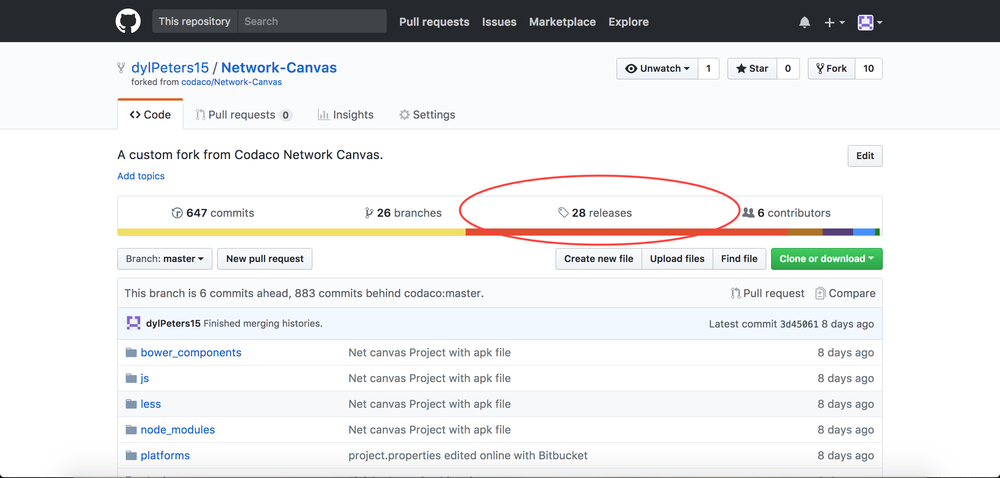 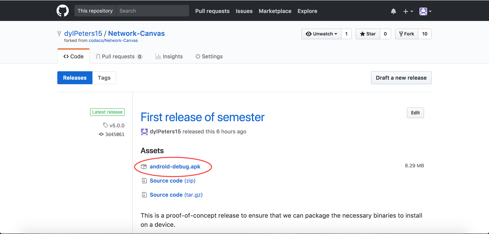 
2. Install [Android File Transfer](https://www.android.com/filetransfer/) on computer.
3. Plug in device. You will be prompted on the device about allowing the computer access to device data. Select "Yes" to allow the computer to access device data. 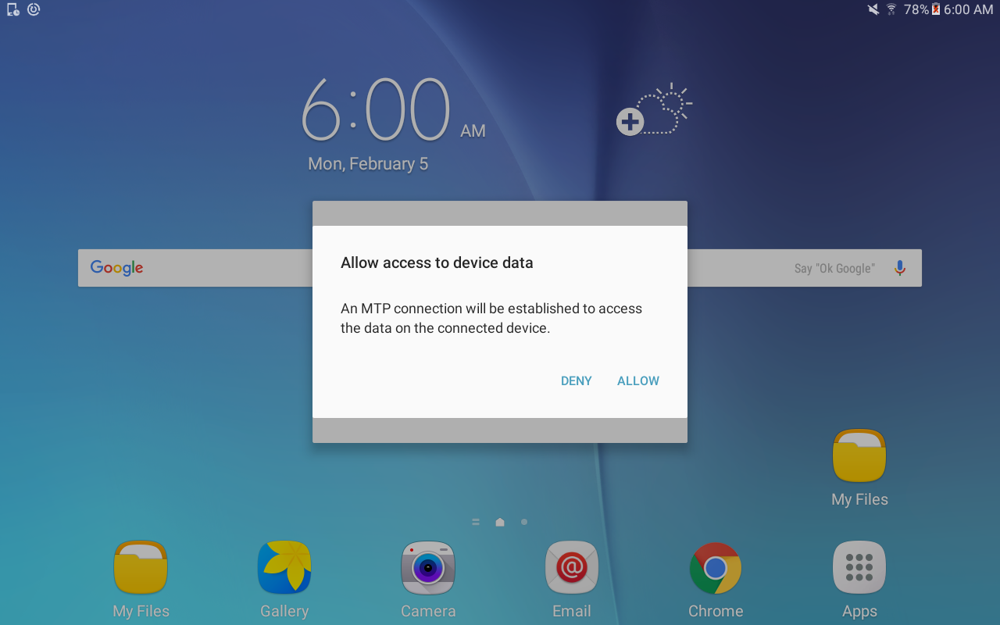 Android File Transfer should open on the computer. 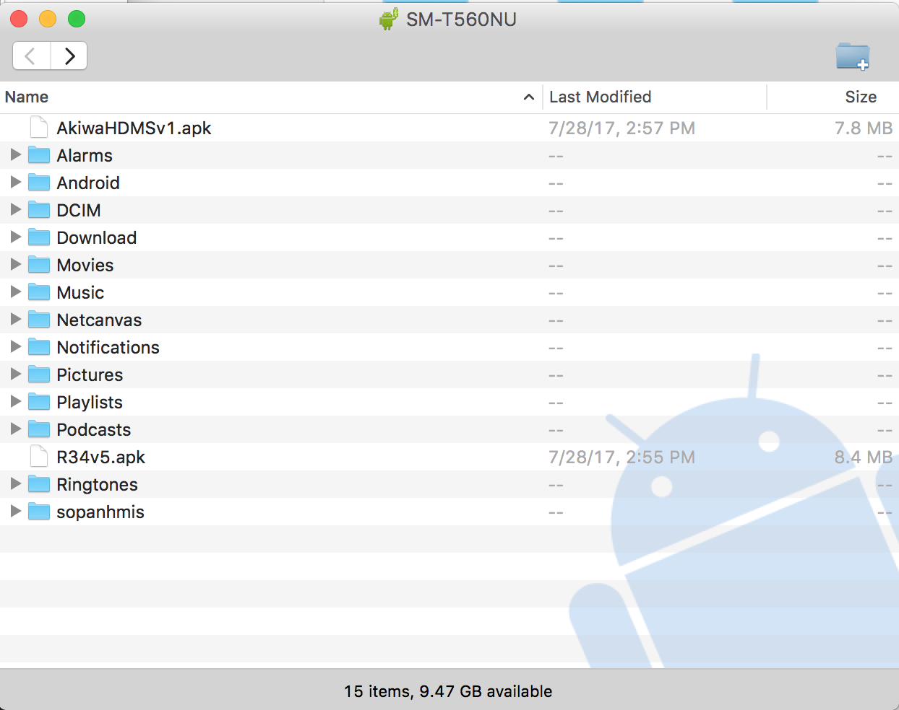
4. Copy the android-debug.apk file from the computer to the device. 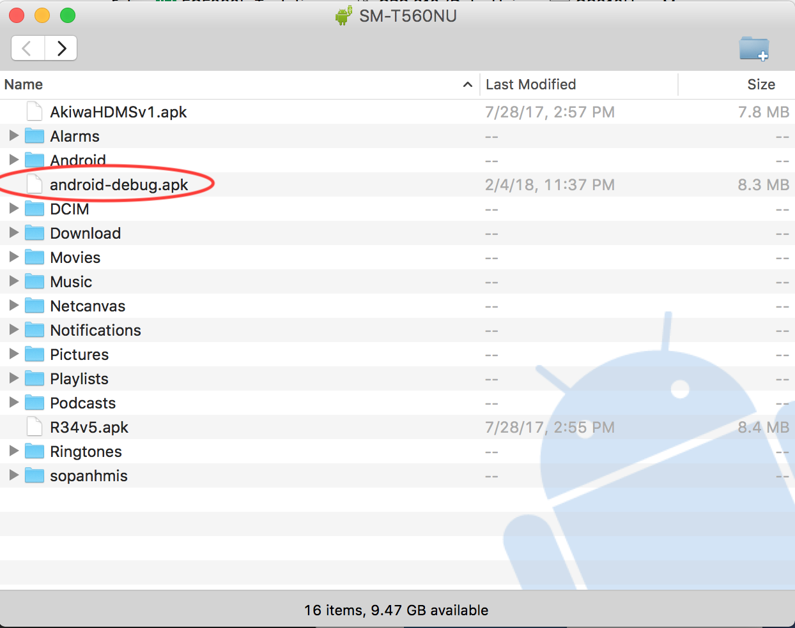
5. On the device, open the "My Files" application. 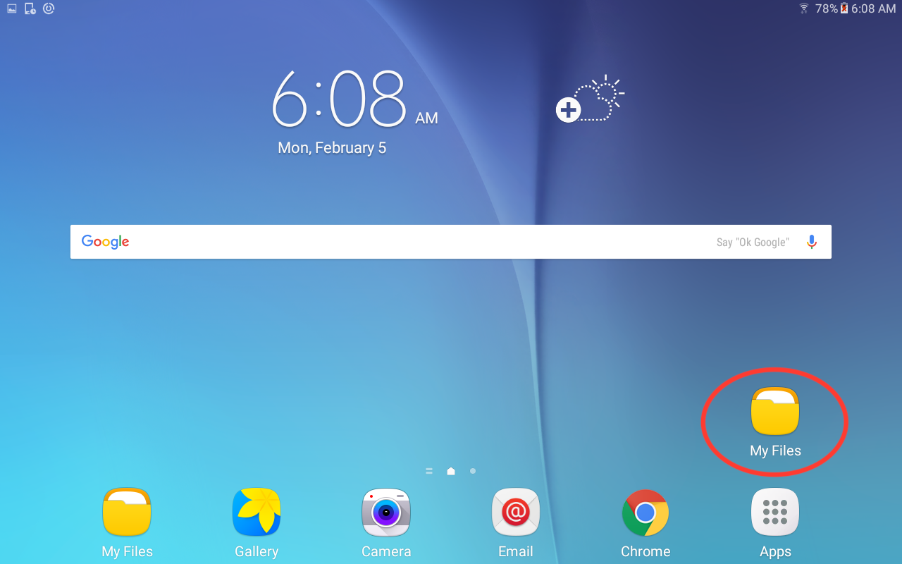
6. Select "Device Storage" to go to the root directory. 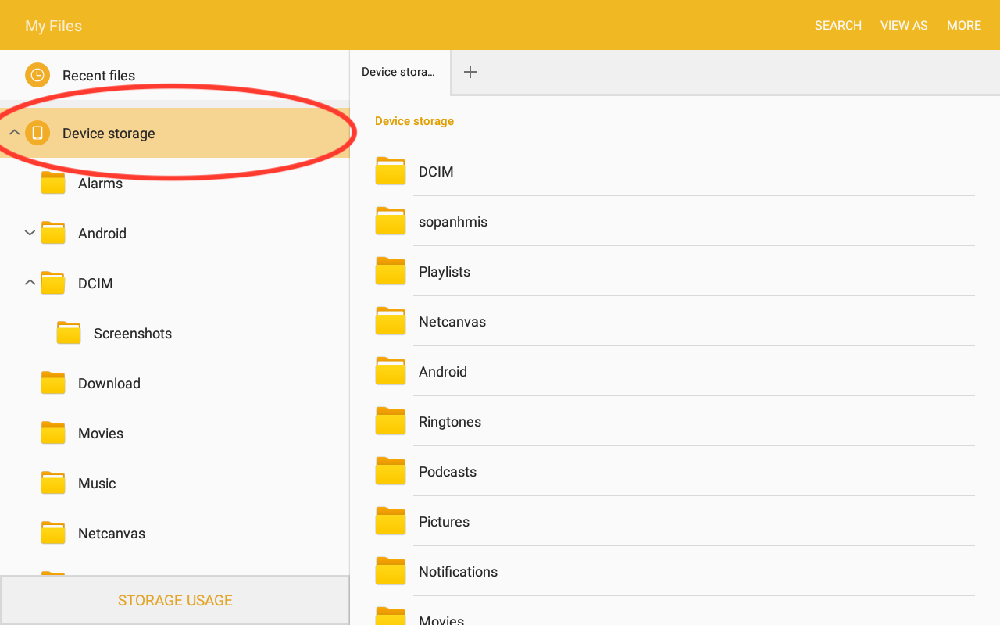
7. Scroll to the bottom of the page and select android-debug.apk. 
8. You may be shown a prompt telling you that you cannot install from unknown sources. Select "Settings". 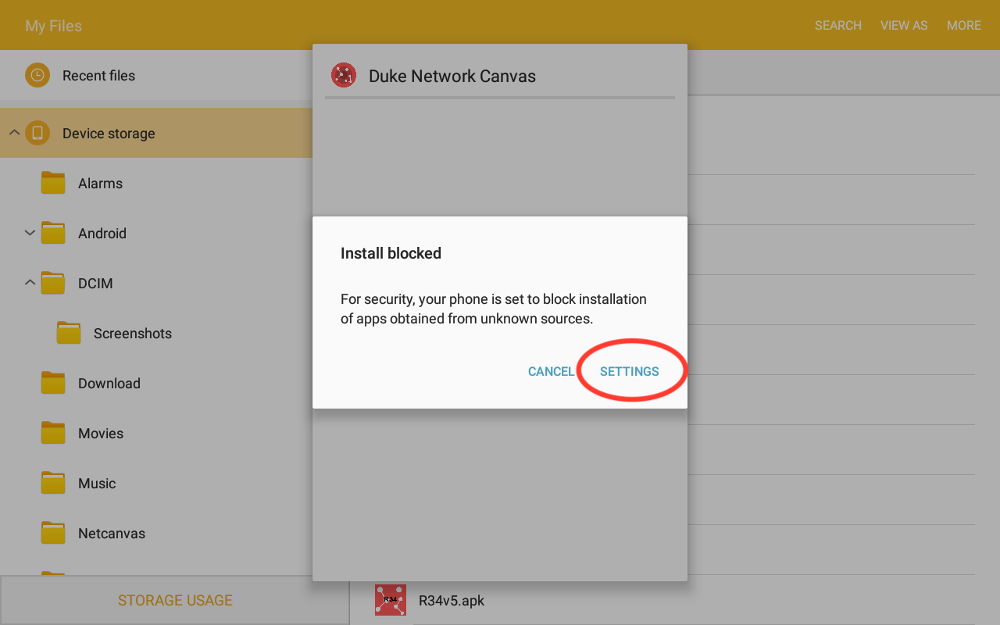
9. In the settings app, if the the switch labeled "Unknown Sources" is in the off position, flip it on. 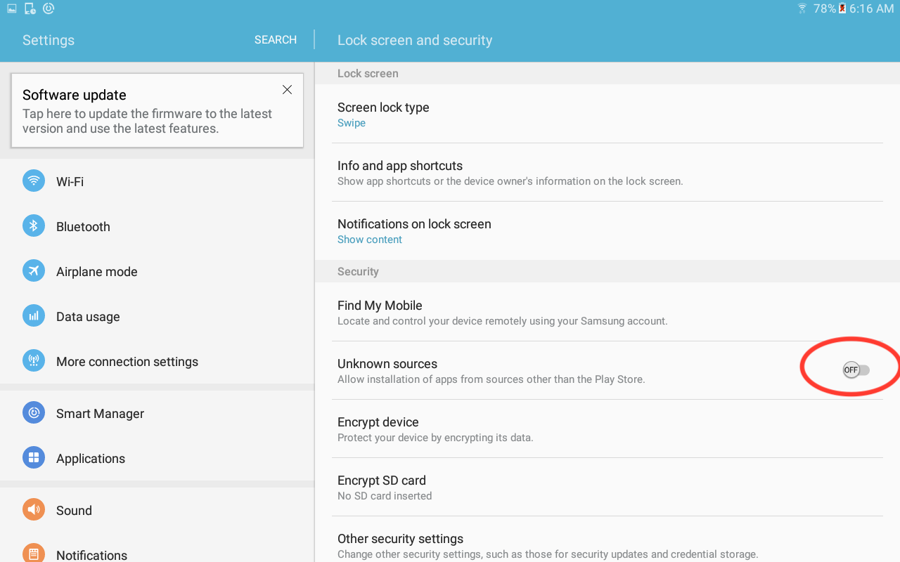
10. You will be prompted with a confirmation prompt. You may choose whether to allow future unknown sources or only allow the current one. If you are unsure, leave the box checked. Tap "OK". 
11. The application will install for a few moments. 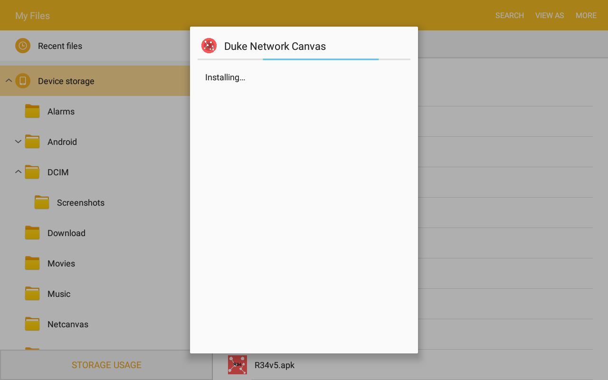
12. If you already have an installation of this app, you will be prompted whether you want to overwrite the current isntallation. Select "Install" to continue. 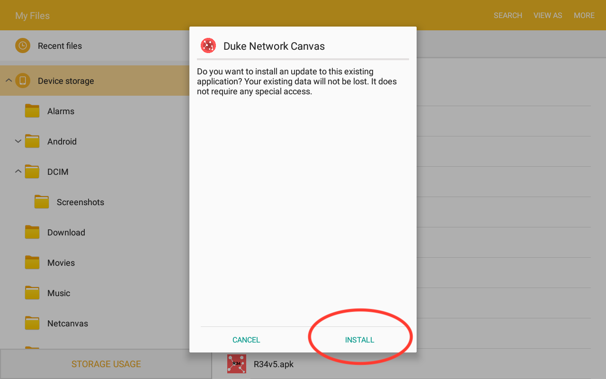
13. When finished, you will be shown an "App Installed" dialog. Select "OPEN" to open your newly installed app. 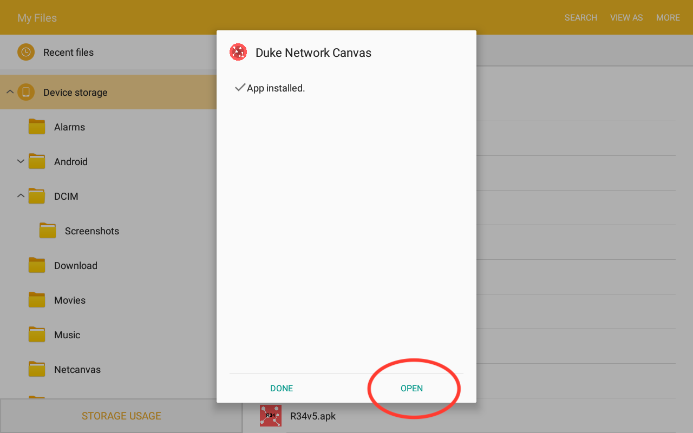
14. The app should open. (Note: the home page of the app may be different than shown in the image.) 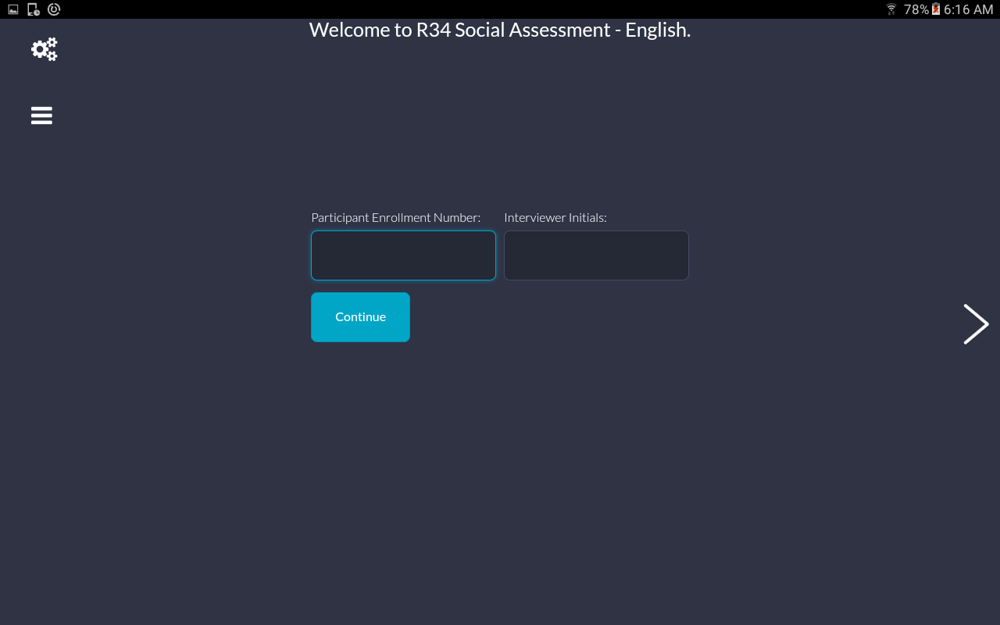

## Best Practices
When using the program to collect sensitive information, we recommend that you take the following security measures:

- Encrypt the device's internal storage.
- Encrypt the device's SD card.
- Create a device password that is required to unlock the device. This is required to access the "administrator-level" functions of the app such as creating new surveys or saving and uploading results. These features will not run if the device does not have a password set.

Steps to complete each of these security measures may differ on different devices.

## How to contribute
The development_notes folder has information about how to contribute to the project or how to download and compile it yourself.