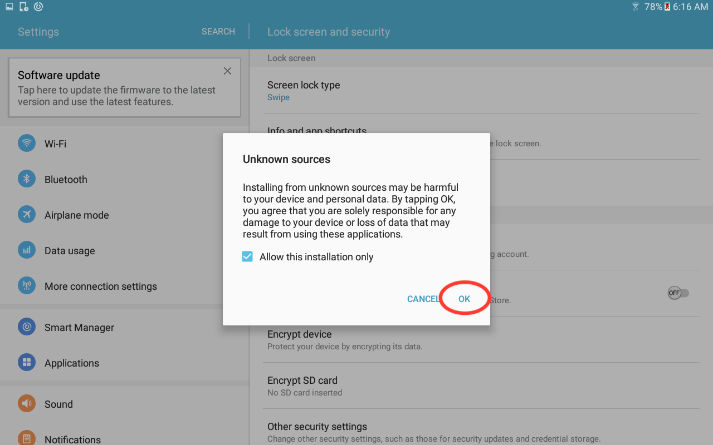

# Duke Social Network Data Collection Tool

## Overview
This project is a fork of netCanvas, copyright Joshua Melville (@jthrilly) <joshmelville@gmail.com>. The original software has continued development, and has now become the open-source project Network Canvas (https://github.com/codaco/Network-Canvas/).

Duke Social Network Data Collection Tool is a project designed to make social network data collection easier and more secure. Researchers can easily create custom surveys and administer them, without needing to know how to code. The data can be uploaded to a secure server without participants or administrators accessing the data.

The program uses [Apache Cordova](https://cordova.apache.org/), to compile [JavaScript](https://www.javascript.com/), [HTML](https://html.com/), and [CSS](https://www.w3schools.com/css/) into a mobile application for Android or iOS. It is currently only tested on Android.

## Acknowledgements
This project is a fork from the [Codaco](https://github.com/codaco) [Network Canvas](https://github.com/codaco/Network-Canvas) project. The project was adapted by Basant Singh and his team during summer 2017, and is currently being developed by undergraduates at Duke University, in partnership with Duke Professors [Marta Mulawa](https://globalhealth.duke.edu/people/faculty/mulawa-marta) and [Robert Duvall](https://users.cs.duke.edu/~rcd/).

## How to put on device
1. Navigate to "Releases" and download the most recent release labeled "android-debug.apk".   
2. Install [Android File Transfer](https://www.android.com/filetransfer/) on computer.
3. Plug in device. You will be prompted on the device about allowing the computer access to device data. Select "Yes" to allow the computer to access device data.  Android File Transfer should open on the computer. 
4. Copy the android-debug.apk file from the computer to the device. 
5. On the device, open the "My Files" application. 
6. Select "Device Storage" to go to the root directory. 
7. Scroll to the bottom of the page and select android-debug.apk. 
8. You may be shown a prompt telling you that you cannot install from unknown sources. Select "Settings". 
9. In the settings app, if the the switch labeled "Unknown Sources" is in the off position, flip it on. 
10. You will be prompted with a confirmation prompt. You may choose whether to allow future unknown sources or only allow the current one. If you are unsure, leave the box checked. Tap "OK". 
11. The application will install for a few moments. 
12. If you already have an installation of this app, you will be prompted whether you want to overwrite the current isntallation. Select "Install" to continue. 
13. When finished, you will be shown an "App Installed" dialog. Select "OPEN" to open your newly installed app. 
14. The app should open. (Note: the home page of the app may be different than shown in the image.) 

## Best Practices
When using the program to collect sensitive information, we recommend that you take the following security measures:

- Encrypt the device's internal storage.
- Encrypt the device's SD card.
- Create a device password that is required to unlock the device. This is required to access the "administrator-level" functions of the app such as creating new surveys or saving and uploading results. These features will not run if the device does not have a password set.

Steps to complete each of these security measures may differ on different devices.

## Contributing - Getting Started
This is a Cordova-based application designed specifically for Android tablets. It may work on Android phones and iOS devices, but no guarantees are made. This document will make the following assumptions:

- The reader plans to use an Android tablet for development or testing. (The testing device may be physical or virtual. Instructions for setting up each will be given.)
- The user's computer is able to execute the UNIX command line and the user has a working knowledge of the command line interface.

1. You will need the following dependencies to develop this project:
	- [git](https://git-scm.com/downloads): This is the version control system used to host and version the files.
	- [Node.js and npm](https://nodejs.org/en/): This is a version of javascript. It has [Cordova](https://www.npmjs.com/package/cordova) (the cross-platform compiler), [Bower](https://www.npmjs.com/package/bower) (a package manager), and [Grunt](https://www.npmjs.com/package/grunt) (a JavaScript task runner) already packaged with it. This project works and builds with **npm version 3.2.0**. In order to install that version, download Node.js from the link above, then run:

	```
	npm install --global npm@3.2.0

	```
	
	
2. Clone the git repository. 

	```
	git clone git@github.com:dylPeters15/Network-Canvas.git
	```

3. Navigate to the git repository using the command line. 

	```
	cd Network-Canvas
	```

4. Compile and run depending on your debugging method of choice. An in-depth description of debugging methods is below.

## Building
1. Open a terminal in the `src` folder. Install npm packages.

	```
	cd src
	npm install
	```

2. Install Bower dependencies.

	```
	bower update
	```
	
3. Create cordova project.

	```
	cordova prepare || cordova prepare
	```
	
	The "|| cordova prepare" is necessary because of a bug in cordova that causes some packages not to install on the first prepare. This is likely due to a dependency issue.

4. Check that all cordova dependencies have been installed.

	```
	cordova requirements
	```
	
	This should print out that all the dependencies are met, but if some are not, install the corresponding dependency. For example, you may need to download [Android Studio and SDK Tools](https://developer.android.com/studio/index.html) or adjust your PATH and JAVA_HOME variables. Getting this right is the trickiest part of building the project.
	
5. Once all requirements are met, build the cordova project to generate an Android Studio project and build an APK file.

	```
	cordova build
	```

6. You can now use either an Android Emulator or a physical device to run and test your code. Follow the steps below to put the application on your emulator/device:
	
## Testing and Debugging with an Emulator

1. Follow the steps in "Building" to ensure you can build the project successfully.
2. Download [Android Studio and SDK Tools](https://developer.android.com/studio/index.html) and [Android File Transfer](https://www.android.com/filetransfer/) if you don't already have them. 
3. Open Android Studio. Select "Start a New Android Studio Project" and create a dummy project. The goal here is not necessarily to use the project you create, but simply to create a new emulator, because Android Studio only allows you to open the emulator manager from within the Project View. Select "Phone and Tablet" and "API 23: Android 6.0 (Marshmallow)", and hit "Next". Select "Add No Activity" and "Finish". Android studio will create a new project.
4. You will likely see this menu in the top right corner:  Select the "AVD Manager" (Android Virtual Device Manager) icon that is circled in red. This will open the Android Virtual Device Manager in a new window.
5. Click "Create New Virtual Device". Select "Tablet" on the left side column. Select "10.1 WXGA (Tablet)" for hardware. For software, select "Marshmallow" and hit "Next". Select "Landscape" for startup orientation, and click "Finish".
6. Now you should be able to run `cordova emulate` and the emulator will automatically power on and run your application.

## Testing and Debugging with a Physical Device
1. Follow the steps in "Building" to ensure you can build the project successfully.
2. Download [Android Studio and SDK Tools](https://developer.android.com/studio/index.html) and [Android File Transfer](https://www.android.com/filetransfer/) if you don't already have them. 
3. Make sure developer mode is ON on your device. [Here](https://www.techadvisor.co.uk/how-to/google-android/34-useful-things-you-can-do-in-android-developer-options-new-3590299/) is how to do that, and information on what developer mode is for.
4. Connect your device. You will be prompted on your device to allow your computer access to files on the device and to allow usb debugging. Click yes for both.
5. You should now be able to run `cordova run`, and the tablet will be loaded with your application and automatically run it.

## Makefile - After Initial Setup

Once you have completed the initial setup outlined in "Building" and "Testing and Debugging with an Emulator" or "Testing and Debugging with a Physical Device," you can use the Makefile included in the repository to speed up and make building easier. Below is a table of the available make options and what they do.

|Command|Description|
|------------------|-----------|
|`make clean`|Removes all the files generated when the build process occurs. These are all untracked files, so it does not damage the repository. Those files will need to be recompiled to be generated again.|
|`make build`|Runs the full build routine, installing all npm packages, bower packages, and cordova packages, then running `cordova build`.|
|`make clean-build`|Removes all generated files then runs full build routine. Basically `make clean` followed by `make build`.|
|`make run`|Runs the full build routine, installing any npm packages, bower packages, and cordova packages, then running `cordova run`. If there is no device attached to the USB port, it will attempt to run on an emulator.|
|`make clean-run`|Removes all generated files then runs full run routine. Basically `make clean` followed by `make run`. If there is no device attached to the USB port, it will attempt to run on an emulator.|

## Methodologies
As priorities evolve, we will create issues in GitHub for each feature to be added and assign priority and assignee for each issue. We will decide which issues we will strive to complete and close during that week.

### Workflow
1. Choose an issue to work on.
2. Get current with origin master. `git pull origin master`
3. Work issue. Commit often.
4. When issue is solved, rebase on master and squash commits.
5. Close issue.
6. At each meeting we will discuss what issues we closed, how the solutions work, and any new issues to be created.

## Tips and Other Notes

### General
This project began in 2013 as an open-source project from Joshua Melville (@jthrilly) <joshmelville@gmail.com>. It then became a [Codaco](https://github.com/codaco/Network-Canvas) project. In 2017, it was modified by contractors working with Duke University staff in order to make it usable on an advanced time-scale to collect data before the main Codaco project was fully implemented. Then, in 2018, it was worked on by Duke University students in order to make it more flexible and allow Duke researchers to create questionaires themselves without needing to code or understand how the program works. The [Codaco repo](https://github.com/codaco/Network-Canvas) is still under active development as of April 2018. 

As a result of the number of times the project has changed hands, the code base has become significantly disorganized and fractured. At the beginning, the project worked using Grunt to compile many JavaScript files into one file, `src/www/js/main.min.js`, in order run them. These are the JavaScript files found in `src/js`. However, at some point, significant changes were made directly to the main.min.js file, and as a result, it is impossible to work with the smaller modular JavaScript files. Any future changes need to be made in the main.min.js file. The same is true for the css of the application. Any changes need to be made in `src/www/css/style.css`. This project will likely not remain in active development for much longer, as the Codaco project is still under active development and is significantly more organized, but this project is useful for allowing researchers to collect data while the Codaco project is still incomplete. 

### `src` Folder Structure

A description of the basic files inside src is as follows:

|Object|Directory or File|Description|
|---|---|---|
|js|Directory|This directory contains many JavaScript files that perform the basic functions of the application. At the beginning of the Network Canvas project, the developer would be able to work with these files, then run a Grunt script to concatenate them all into a single, runnable JavaScript file, but that is no longer possible. Therefore, these files are here simply as a historical artifact. Changes in these files do not affect the application's behavior. To make changes to the application, change the file `src/www/js/main.min.js`.|
|less|Directory|This directory contains [.less](http://lesscss.org/) files. When the project began, these files would be compiled by a Grunt script and generate css files that would modify the program's appearance. However, as a result of the project's current fragmentation, these files do not do anything. Changing these files will not affect the output or appearance of the program. To do that, work on the file `src/www/css/style.css`.|
|resources|Directory|This directory contains icons, scripts, and packages needed to compile the application.|
|www|Directory|This is the main directory where changes will need to be made in order to work on the application. This directory is copied onto the device when the program is run on a device. The www directory contains all of the JavaScript, HTML files, and css files that will run on the device. To make changes to the application, work on either the index.html file or the js/main.min.js file. Then run `cordova run` or `make clean_run` to run the program.|
|bower.json|file|[Bower](https://bower.io/) is a package manager, similar to npm. This file describes all of the currently installed Bower packages. The Bower file has been out of date since before the beginning of 2018, so it is left in the repo as a historical artifact, but it is not runnable.|
|config.xml|file|This file describes the Cordova project. It describes the version numbers for plugins and platforms of the Cordova project, as well as permissions. This is the main "table of contents" for the project.|
|Gruntfile.js|file|[Grunt](https://gruntjs.com/) is a script runner that can be used to help automate production processes. Grunt was the utility that was used in the past on this project to concatenate all of the JavaScript files, compile the .less files into css files, etc., but because all of those processes no longer work, this is left in the repo as a historical artifact.|
|License.md|file|Describes the license under which this project is produced.|
|Makefile|file|[Makefile](https://en.wikipedia.org/wiki/Makefile) is a file that automates the compilation of the project. Essentially, it runs a series of command line instructions. For a full list of the instructions in the Makefile, see the section [Makefile - After Initial Setup](https://github.com/dylPeters15/Network-Canvas#makefile---after-initial-setup).|
|package-lock.json|file|This file describes every package installed by npm and its version number. It is recreated every time `npm install` is run. This file changes often, as new updates to those packages are released.|
|package.json|file|This file describes the first level (not the entire tree, as package-lock.json does) of dependencies. It specifies version ranges but not specific version numbers. This file changes less frequently than package-lock.json, as it does not change when new package updates are released.|

## Helpful Links

Here will be posted links that were found to be helpful during development and testing of the application. This will aid future developers (or current developers in the future) to avoid wasting time solving problems that have already been solved.


|Link|Description|
|----|-----------|
|[https://www.tutorialspoint.com/cordova/cordova\_file\_transfer.htm](https://www.tutorialspoint.com/cordova/cordova_file_transfer.htm)|Information about Cordova File Transfer plugin. Useful for debugging server upload.|
|[https://cordova.apache.org/docs/en/latest/reference/cordova-plugin-file/](https://cordova.apache.org/docs/en/latest/reference/cordova-plugin-file/)|Cordova File plugin. Contains code for reading, writing, and moving files using Cordova.|
|[https://cordova.apache.org/#getstarted](https://cordova.apache.org/#getstarted)|Cordova tutorial.|
|[https://cordova.apache.org/docs/en/latest/guide/cli/](https://cordova.apache.org/docs/en/latest/guide/cli/)|Very useful first-time Cordova guide.|
|[https://www.npmjs.com/package/cordova](https://www.npmjs.com/package/cordova)|npm's Cordova download page. Contains information about how to install Cordova using npm.|
|[https://docs.npmjs.com/getting-started/what-is-npm](https://docs.npmjs.com/getting-started/what-is-npm)|npm overview. What is npm? Very helpful for learning about how managing JavaScript packages works.|
|[https://gist.github.com/isaacs/62a2d1825d04437c6f08](https://gist.github.com/isaacs/62a2d1825d04437c6f08)|Makefile tutorial. Helpful for understanding what the makefile does.|
|[https://www.w3schools.com/js/default.asp](https://www.w3schools.com/js/default.asp)|This website has a lot of JavaScript tutorials, on anything from string manipulation to function definitions.|
|[https://stackoverflow.com/questions/45022048/why-does-npm-install-rewrite-package-lock-json](https://stackoverflow.com/questions/45022048/why-does-npm-install-rewrite-package-lock-json)|Discussion of package-lock.json changing when running `npm install`.|